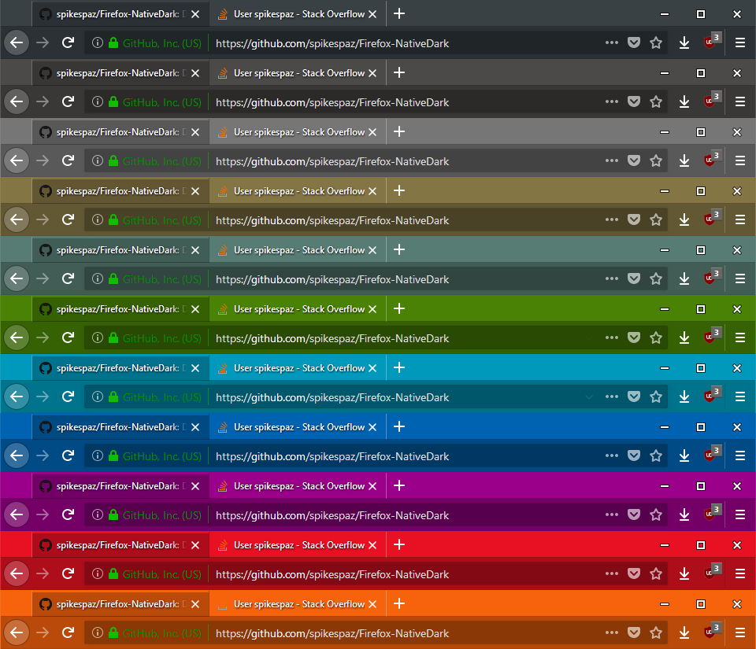
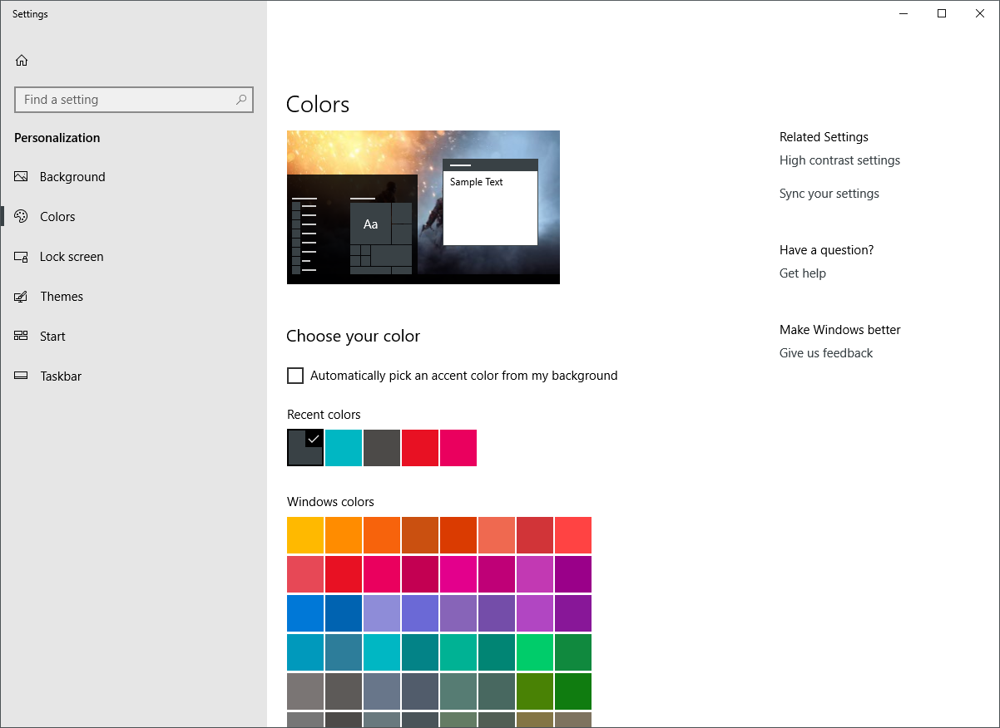
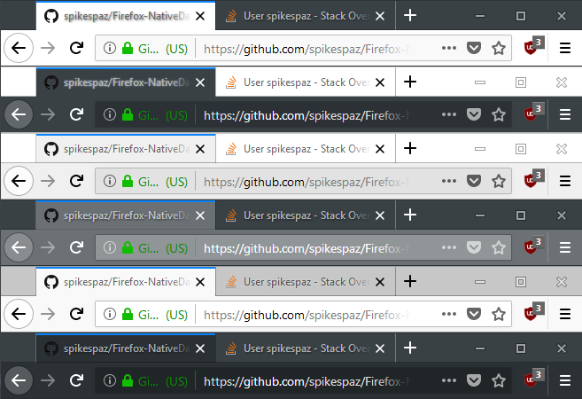
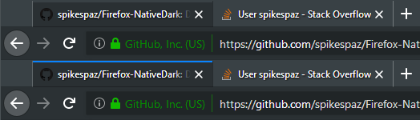

# Firefox-NativeDark
[](https://github.com/spikespaz/firefox-nativedark/releases/latest/)
[](https://github.com/spikespaz/firefox-nativedark/blob/master/LICENSE/)
[](https://addons.mozilla.org/firefox/addon/native-dark/versions/)
[](https://addons.mozilla.org/en-US/firefox/addon/native-dark/reviews/)
[](https://addons.mozilla.org/firefox/addon/native-dark/reviews/)
[](https://github.com/spikespaz/firefox-nativedark/stargazers/)

**Native Dark** is a theme for Firefox Quantum that aims to add support for the Windows 10 Accent Color, set in Personalization Settings. Support is also added for other systems, and the colors can be customized in the options page. On other systems besides Windows, functionality is limited to a solid, non-adapting color that is not guaranteed to match your system colors. The original intent was to mainly replace the default themes of Firefox, because the light theme was adaptive in the titlebar and not the tabs. It allows for the same adaptive titlebar as the default light theme, but combines the aesthetic of the dark theme's tabs.

[](https://addons.mozilla.org/firefox/downloads/file/883296/native_dark-1.6-an+fx.xpi?src=dp-btn-primary)

Get it at Add-ons for Firefox: https://addons.mozilla.org/firefox/addon/native-dark/

The theme was originally meant to work with just dark colors, (specifically `#394145`, the darkest color that Windows allows) but while I was making the script to get the system accent colors, the only way to create variations was to create transparent layers of black over top. I accidentally discovered that it would work with other themes, and proceeded to put the below image together.

## Examples
**Below are examples of 11 different accent colors. Only the first is a custom color.**

The tabs and body of the toolbar is 25% darker than the accent color, and the inside of the omni bar is 50% darker than the accent color. The text will always remain pure white, I have found that this looks best.



## Usage
The theme should work with just about any accent colors, however, the font will look a little funny on super light colors. Try to keep the accent color in Windows dark enough so that the text color doesn't conflict with the background.

Make sure that you have a good accent color selected from the palette in `Windows > Settings (Gear) > Personalization > Colors`.



## Unfocused
By request of two users (and probably unspoken by several others), I have added more modes for unfocused Windows.
Among these are `Tabs`, `Title`, `Both`, `Fade`, `Reset`, and `None`.

**Here they are, in order.**



To customize the unfocused theme and other settings, go to the addons options page.

1. Go to `about:addons` in the URL bar.
2. Find the `Native Dark` extension in the list, and click `Options` on the right.
3. Change things.
4. ???
5. Profit!

## Optional
When the background for the title bar is set, the pretty blue line above active tabs is lost. ~~Unfortunately, I have yet to find a way to fix this within the theme itself. The one way to fix it us by adding a custom `userChrome.css` to your profile directory.~~ **Update:** In Firefox version 60 and above, the ability to change the tab line color has been added to the theming API. If you have the latest version of Firefox, or the Nightly, this should be enabled. It can be customized in the theme options page. Check `about:support` under "Application Basics - Version" too see if you have it.

This is what it changes, top is before, bottom is after.



**In short, here is what you need to do to add this to your profile.**

1. Open `about:support` in the URL bar.
2. Under `Application Basics`, find `Profile Folder` and click the button that says `Open Folder`.
3. Download this repository by clicking the green `Clone or download > Download ZIP` button on [Github](https://github.com/spikespaz/Firefox-NativeDark).
    * Or use this [direct link](https://github.com/spikespaz/Firefox-NativeDark/archive/master.zip).
4. Find the downloaded archive, open it, and extract the folder called `chrome`.
5. Move the extracted `chrome` into the profile folder that you opened earlier.

*You may need to restart firefox for the stylesheet to take effect.*

Alternatively, copy the code below and use it as a base for modifications in your `userChrome.css`.

```css
.tab-line {
    -moz-box-ordinal-group: 1;
}

.tab-line[selected=true] {
    background-color: #0A84FF !important;
}
```

For example, change `-moz-box-ordinal-group` to `2` to make the active indicator line appear on the bottom of the tab, or change the hex value `#0A84FF` for a different color.

There's a great resource for references on what can be put into `userChrome.css` at the [UserChrome-Tweaks](https://github.com/Timvde/UserChrome-Tweaks) community repository, or the [FirefoxCSS Subreddit](https://www.reddit.com/r/FirefoxCSS/).

For more information about what `userChrome.css` is, see the [website for it](https://www.userchrome.org/).

## Issues
This is really only meant to work in Windows 10. On other systems, it just defaults to the dark theme shown in the top example. **Please don't ask me why it doesn't sync with your theme in Linux!**

Please submit issues or suggestions to the [Issues page on the GitHub repository](https://github.com/spikespaz/Firefox-NativeDark/issues).

[<sub>Shield badges provided by Shields.io.</sub>](https://shields.io)
